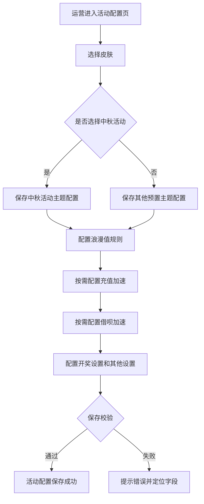
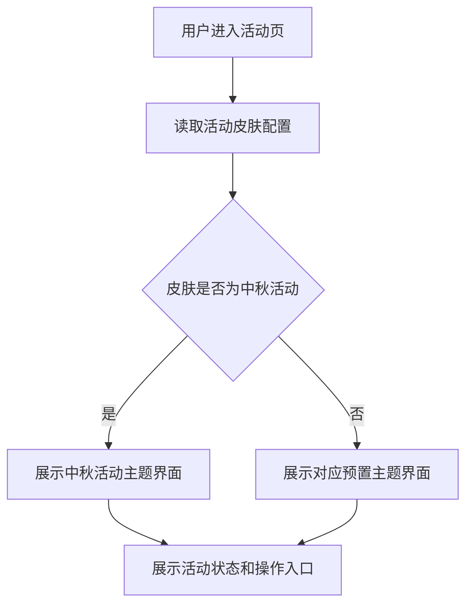
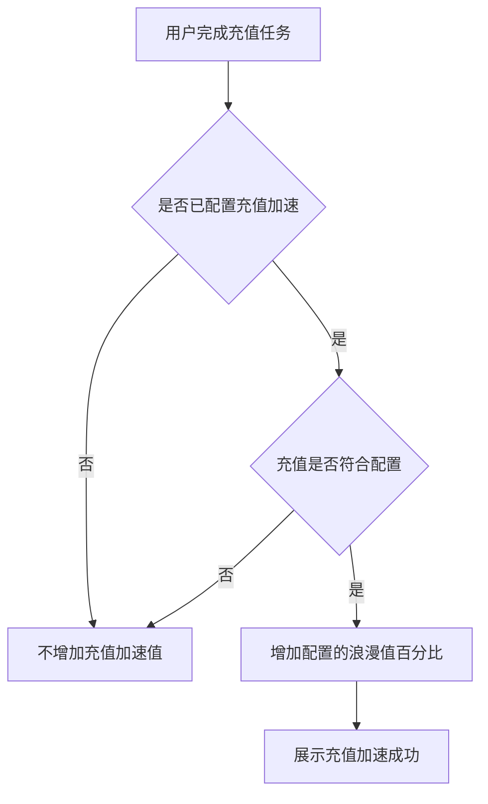
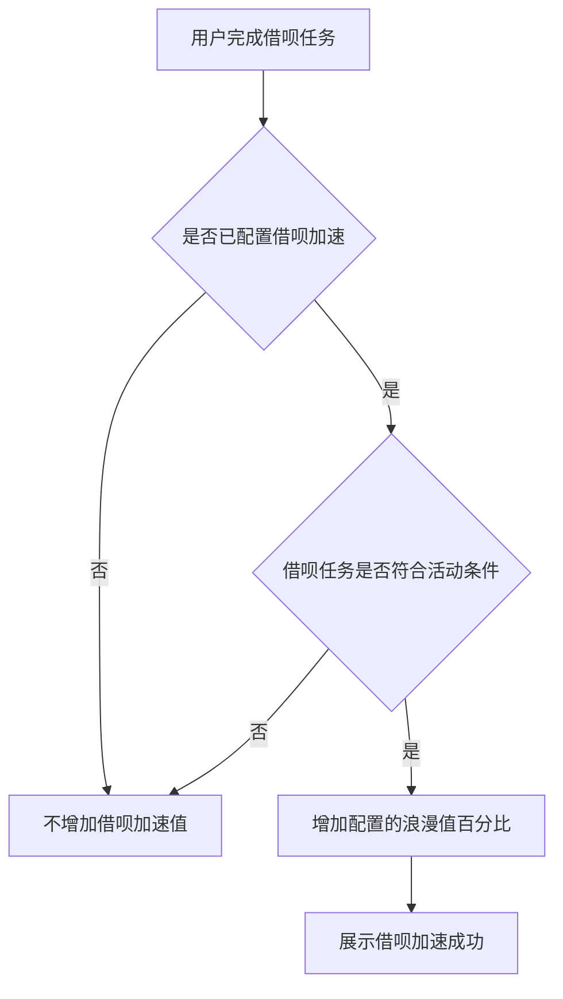
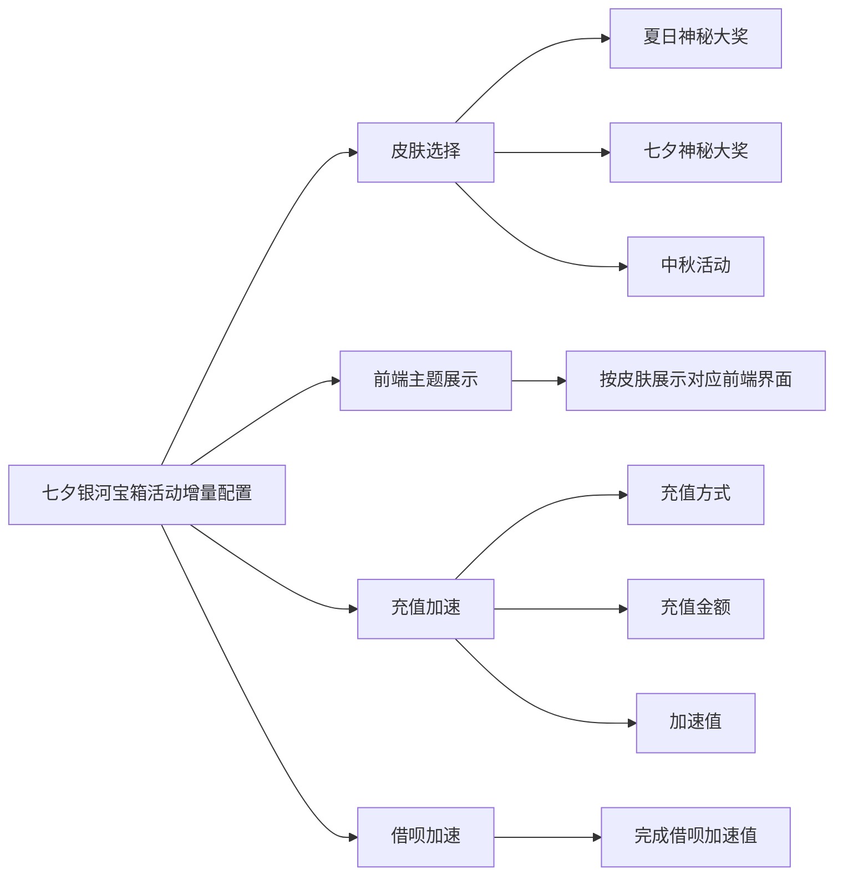

## 目录
- [[#§1 修订追踪表]]
- [[#§2 背景与目标]]
- [[#§3 功能清单]]
- [[#§4 功能细节规格]]
- [[#§5 功能流程图]]
- [[#§6 功能结构图]]
- [[#§7 页面设计 / Wireframe]]
- [[#§8 Corner Case]]
- [[#§9 验收清单]]

## 本文件使用说明
- 本 PRD 为七夕银河宝箱活动配置的增量需求文档。
- 原主 PRD 参考：[[PRD_qixi_galaxy_box_activity_2026-07-31.md]]
- 原型文件参考：[[qixi-galaxy-box-activity-prototype.html]]
- 本文仅描述本次本地更新内容，不重复完整活动基础规则。

## §1 修订追踪表

| 版本 | 日期 | 作者 | 说明 |
|---|---|---|---|
| V1 | 2026-09-15 | 产品 | 增量需求初稿 |

## §2 背景与目标

### 2.1 背景
- 七夕银河宝箱活动配置已支持基础信息、皮肤、浪漫值、充值加速、开奖设置等参数。
- 运营需要在同一活动配置能力中支持中秋主题皮肤。
- 运营需要将充值加速和借呗加速设为可选配置，避免未配置时阻断活动保存。

### 2.2 目标
- 支持运营在皮肤选择中选择“中秋活动”。
- 当皮肤选择为“中秋活动”时，用户端前端界面切换为中秋活动主题。
- 充值加速配置为非必填，配置后用户完成对应充值任务才获得加速值。
- 借呗加速配置为非必填，配置后用户完成借呗任务才获得加速值。

### 2.3 范围边界
- 本次新增和调整仅影响活动配置页、前端皮肤展示和加速值计算逻辑。
- 不调整活动基础签到规则。
- 不调整开奖设置字段。
- 不调整奖励生成和发放口径。

## §3 功能清单

| 页面编号 | 页面/模块 | 类型 | 使用方 | 说明 |
|---|---|---|---|---|
| P1 | 皮肤选择配置 | [MOD] | 运营后台 | 皮肤选项新增“中秋活动” |
| P2 | 前端主题展示 | [MOD] | 用户端 | 选择中秋活动后，前端展示中秋活动界面 |
| P3 | 充值加速配置 | [MOD] | 运营后台/用户端 | 改为非必填，配置后完成充值任务获得加速值 |
| P4 | 借呗加速配置 | [NEW] | 运营后台/用户端 | 新增完成借呗加速值配置，非必填，配置后完成借呗任务获得加速值 |

## §4 功能细节规格

### P1. 皮肤选择配置

#### 4.1.1 字段规格

| 字段 | 类型 | 必填 | 默认值 | 说明 |
|---|---|---|---|---|
| 皮肤选择 | 下拉选择 | 是 | 七夕神秘大奖 | 支持“夏日神秘大奖”“七夕神秘大奖”“中秋活动” |

#### 4.1.2 规则说明
- 选择“七夕神秘大奖”时，前端展示七夕主题活动界面。
- 选择“夏日神秘大奖”时，前端展示夏日主题活动界面。
- 选择“中秋活动”时，前端展示中秋活动主题界面。
- 皮肤素材由系统预置，活动配置中不支持上传图片。

### P2. 前端主题展示

#### 4.2.1 展示规则
- 用户端根据后台皮肤选择展示对应主题界面。
- 运营切换皮肤并保存后，用户端活动入口、弹窗、宝箱、按钮、背景和状态视觉需与所选主题一致。
- 中秋活动主题需覆盖未开启、已开启、已领取、签到成功、充值加速成功、借呗加速成功、开奖中、奖励获得等状态。

#### 4.2.2 异常规则
- 若前端未获取到皮肤配置，按默认皮肤展示。
- 若选择“中秋活动”但对应素材未配置完整，用户端不应出现空白、错位或无法操作状态。

### P3. 充值加速配置

#### 4.3.1 字段规格

| 字段 | 类型 | 必填 | 默认值 | 说明 |
|---|---|---|---|---|
| 充值方式 | 下拉选择 | 否 | 任意充值 | 未配置充值加速时不生效 |
| 充值金额 | 文本输入 | 否 | 不限制 | 填写“不限制”表示任意有效充值均可触发 |
| 加速值配置 | 数字输入 | 否 | 15% | 用户完成符合条件的充值后增加的浪漫值百分比 |

#### 4.3.2 规则说明
- 充值加速为非必填配置。
- 未配置充值加速时，不影响活动保存，用户完成充值后不获得该项加速值。
- 配置充值加速后，用户完成符合配置的充值任务，可获得对应加速值。
- 充值方式为“任意充值”且充值金额为“不限制”时，任意有效充值均可触发该项加速。
- 充值加速值按百分比展示，前端展示为“+配置值% 浪漫值”。

### P4. 借呗加速配置

#### 4.4.1 字段规格

| 字段 | 类型 | 必填 | 默认值 | 说明 |
|---|---|---|---|---|
| 完成借呗加速值配置 | 数字输入 | 否 | 15% | 用户完成借呗任务后增加的浪漫值百分比 |

#### 4.4.2 规则说明
- 借呗加速为非必填配置。
- 未配置借呗加速时，不影响活动保存，用户完成借呗后不获得该项加速值。
- 配置借呗加速后，用户完成借呗任务，可获得对应加速值。
- 充值加速与借呗加速分别判断，互不替代。
- 若两个加速配置均已配置，且用户分别完成对应任务，则按活动规则累计浪漫值。

## §5 功能流程图

### 5.1 后台配置流程

### 5.2 用户端主题展示流程

### 5.3 充值加速流程

### 5.4 借呗加速流程

## §6 功能结构图

## §7 页面设计 / Wireframe

### 7.1 活动配置页调整
- 皮肤选择下拉框新增“中秋活动”选项。
- 充值加速配置区域不展示必填标识。
- 借呗加速配置区域不展示必填标识。
- 借呗加速配置放在充值加速配置之后、开奖设置之前。

### 7.2 字段展示要求
- 充值加速配置标题提示：选填，配置后充值可额外增加浪漫值。
- 借呗加速配置标题提示：选填，配置后完成借呗可额外增加浪漫值。
- “完成借呗加速值配置”字段使用数字输入框，右侧展示百分比单位。

### 7.3 前端展示要求
- 选择中秋活动后，用户端整体视觉切换为中秋活动主题。
- 前端不得继续展示七夕主题专属素材。
- 中秋主题下仍需保留活动状态、签到、加速、开奖和领取链路。

## §8 Corner Case

| 编号 | 场景 | 预期行为 |
|---|---|---|
| CC-1 | 未配置充值加速 | 活动可保存，用户充值后不获得充值加速值 |
| CC-2 | 已配置充值加速但加速值非法 | 保存时拦截，并提示填写有效百分比 |
| CC-3 | 未配置借呗加速 | 活动可保存，用户完成借呗后不获得借呗加速值 |
| CC-4 | 已配置借呗加速但加速值非法 | 保存时拦截，并提示填写有效百分比 |
| CC-5 | 选择中秋活动但前端素材缺失 | 用户端不出现空白或不可操作状态，需降级展示默认主题或提示配置异常 |
| CC-6 | 用户只完成充值任务 | 仅在充值加速已配置且条件满足时增加充值加速值 |
| CC-7 | 用户只完成借呗任务 | 仅在借呗加速已配置且条件满足时增加借呗加速值 |
| CC-8 | 用户同时完成充值和借呗任务 | 两项均已配置时按活动规则累计浪漫值 |

## §9 验收清单

### 9.1 功能验收

| # | 功能名称 | 验收标准 | 判定方式 | 通过 |
|---|---|---|---|---|
| 1 | 中秋皮肤选项 | 皮肤选择下拉框包含“中秋活动” | 新建或编辑活动检查下拉选项 | - [ ] |
| 2 | 中秋前端展示 | 选择中秋活动并保存后，用户端展示中秋活动主题界面 | 保存后进入用户端活动页检查 | - [ ] |
| 3 | 充值加速选填 | 不配置充值加速时活动可保存 | 清空或不配置充值加速后保存 | - [ ] |
| 4 | 充值加速生效 | 配置充值加速后，用户完成符合条件的充值可获得对应加速值 | 完成充值并核对浪漫值变化 | - [ ] |
| 5 | 借呗加速选填 | 不配置借呗加速时活动可保存 | 清空或不配置借呗加速后保存 | - [ ] |
| 6 | 借呗加速生效 | 配置借呗加速后，用户完成借呗可获得对应加速值 | 完成借呗并核对浪漫值变化 | - [ ] |

### 9.2 非功能性验收

| # | 项目 | 验收标准 | 判定方式 | 通过 |
|---|---|---|---|---|
| 1 | 兼容性 | 新增中秋皮肤不影响原夏日和七夕皮肤展示 | 分别切换三种皮肤验收 | - [ ] |
| 2 | 数据准确性 | 充值加速和借呗加速按配置独立计算 | 抽样核对用户活动记录 | - [ ] |
| 3 | 可配置性 | 运营可独立配置或留空两个加速模块 | 后台保存并回显 | - [ ] |

### 9.3 Corner Case 验收
- 覆盖 §8 全部 Corner Case。

### 9.4 专项验收

| # | 专项 | 验收标准 | 判定方式 | 通过 |
|---|---|---|---|---|
| 1 | 主题切换 | 中秋活动、七夕神秘大奖、夏日神秘大奖切换后前端展示正确 | 视觉走查 | - [ ] |
| 2 | 加速链路 | 充值加速和借呗加速在配置、未配置两种状态下均符合预期 | 端到端测试 | - [ ] |

## 下一步建议
- 由设计确认中秋活动预置皮肤素材。
- 由运营确认充值加速和借呗加速默认值是否保留 15%。
- 由开发确认未配置加速项时的保存、回显和前端展示处理。
