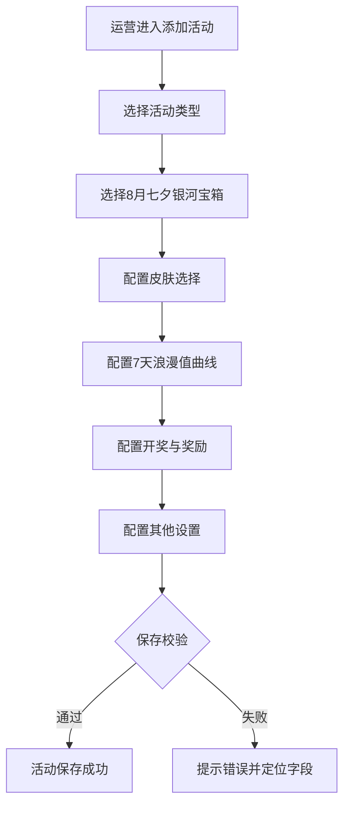
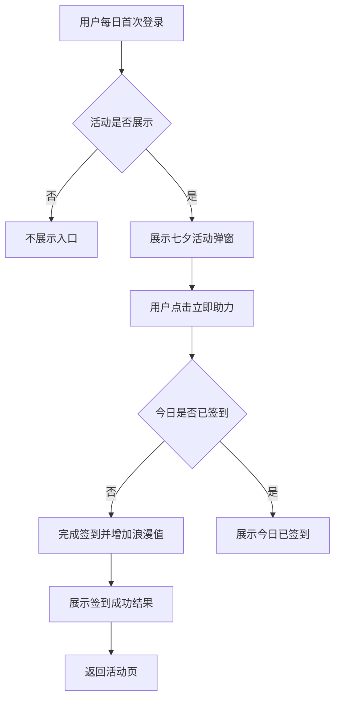
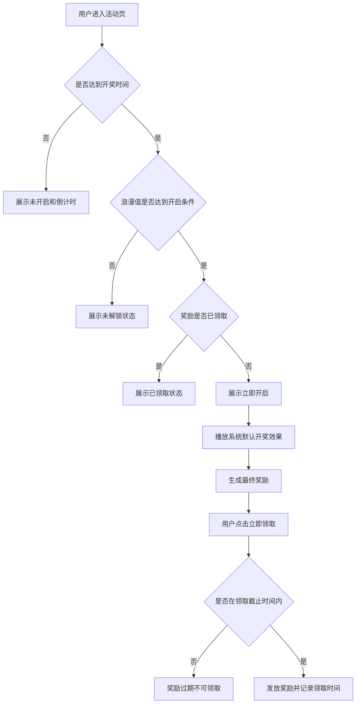
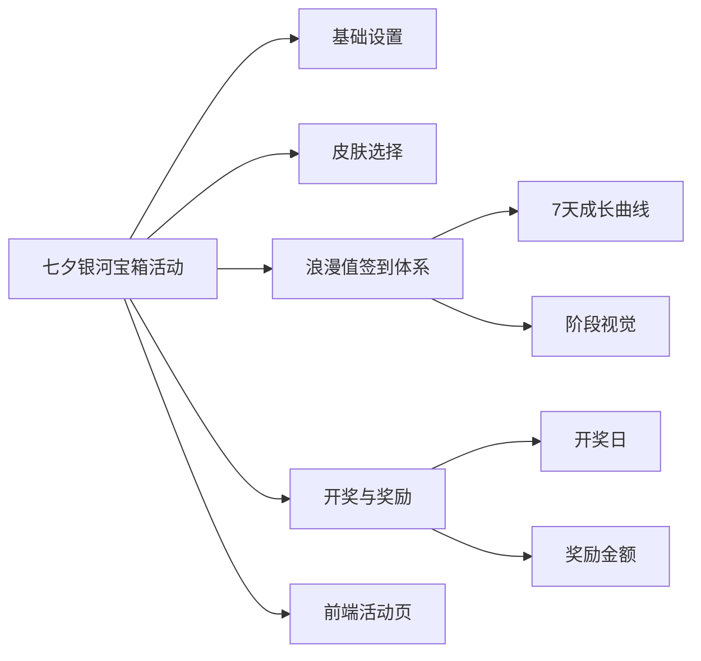

## 目录
- [[#§1 修订追踪表]]
- [[#§2 背景与目标]]
- [[#§3 功能清单]]
- [[#§4 功能细节规格]]
- [[#§5 功能流程图]]
- [[#§6 功能结构图]]
- [[#§7 页面设计 / Wireframe]]
- [[#§8 Corner Case]]
- [[#§9 验收清单]]

## 本文件使用说明
- 本 PRD 基于《七夕情人节活动.docx》和前端设计稿整理。
- 目标是在运营后台“添加活动”中新增“8月七夕银河宝箱”活动类型，并配置活动参数。
- 前端设计稿参考：[[qixi-frontend-design.jpg]]
- 原型文件参考：[[qixi-galaxy-box-activity-prototype.html]]

## §1 修订追踪表

| 版本 | 日期 | 作者 | 说明 |
|---|---|---|---|
| V1 | 2026-07-31 | 产品 | 初稿 |

## §2 背景与目标

### 2.1 活动背景
- 活动名称：七夕浪漫神秘大奖。
- 活动定位：8月七夕主题运营活动。
- 核心玩法：用户连续签到积累浪漫值，达到开奖条件后开启七夕神秘大奖。

### 2.2 业务目标
- 提升用户签到率。
- 提升活动活跃留存。
- 提升充值转化。
- 提升 VIP 用户参与度。
- 通过首页置顶和主题皮肤增强活动曝光。

### 2.3 核心原则
- 前端全页面隐藏真实奖励金额，仅展示浪漫值百分比和活动状态。
- 用户每日登录自动弹出活动弹窗，引导签到和活动参与。

## §3 功能清单

| 页面编号 | 页面/模块 | 类型 | 使用方 | 说明 |
|---|---|---|---|---|
| P1 | 添加活动配置页 | [NEW] | 运营后台 | 新增“8月七夕银河宝箱”活动类型和基础参数 |
| P2 | 皮肤选择配置 | [NEW] | 运营后台 | 配置活动前端使用的主题皮肤 |
| P3 | 浪漫值签到体系配置 | [NEW] | 运营后台 | 配置 7 天签到成长曲线、阶段文案和视觉状态 |
| P4 | 开奖与奖励配置 | [NEW] | 运营后台 | 配置开奖日、滚动数字和最终奖励 |
| P5 | 前端活动页 | [NEW] | 用户端 | 展示七夕主题页、浪漫值、宝箱状态和领取入口 |

## §4 功能细节规格

### P1. 添加活动配置页

#### 4.1.1 基础设置

| 字段 | 类型 | 必填 | 默认值 | 说明 |
|---|---|---|---|---|
| 活动ID | 文本输入 | 是 | QIXI202608 | 活动唯一标识 |
| 活动标题 | 文本输入 | 是 | 七夕浪漫神秘大奖 | 后台和前端活动标题 |
| 活动说明 | 文本输入 | 是 | 连续签到积累浪漫值，解锁七夕神秘大奖 | 活动简短说明 |
| 活动类型 | 下拉选择 | 是 | 8月七夕银河宝箱 | 新增活动类型 |
| 活动状态 | 下拉选择 | 是 | 启用 | 支持启用、停用 |

#### 4.1.2 其他设置

| 字段 | 类型 | 必填 | 默认值 | 说明 |
|---|---|---|---|---|
| 归属 | 下拉选择 | 是 | 全站 | 支持全站、指定站点、指定代理线 |
| 标签 | 下拉选择 | 否 | 七夕活动 | 活动标签 |
| 开始时间 | 日期时间输入 | 是 | 2026-08-14 00:00:00 | 活动整体开始时间 |
| 结束时间 | 日期时间输入 | 是 | 2026-08-20 23:59:59 | 活动整体结束时间 |
| 站内信模板 | 下拉选择 | 否 | 七夕活动通知 | 发送活动通知使用的站内信模板 |
| 开始发送时间 | 日期时间输入 | 是 | 2026-08-14 00:00:00 | 站内信开始发送时间 |
| 每小时发送次数 | 数字输入 | 是 | 0 | 站内信发送频率，仅允许 0 至 999999 的整数 |
| 前端展示 | 单选 | 是 | 展示 | 控制用户端是否展示活动 |
| 备注 | 多行文本 | 否 | 规则摘要 | 记录运营备注 |

### P2. 皮肤选择配置

#### 4.2.1 皮肤参数

| 字段 | 类型 | 必填 | 默认值 | 说明 |
|---|---|---|---|---|
| 皮肤选择 | 下拉选择 | 是 | 七夕神秘大奖 | 支持选择“夏日神秘大奖”或“七夕神秘大奖” |

#### 4.2.2 皮肤规则
- 选择“七夕神秘大奖”时，前端使用七夕主题活动皮肤。
- 选择“夏日神秘大奖”时，前端使用夏日主题活动皮肤。
- 皮肤素材由系统预置，不在活动设置中上传图片。

### P3. 浪漫值签到体系配置

#### 4.3.1 签到成长曲线

| 天数 | 浪漫值 | 默认状态 | 阶段文案 | 说明 |
|---|---:|---|---|---|
| Day1 | 10% | 已签到 | 初遇浪漫 | 首日签到奖励 |
| Day2 | 20% | 已签到 | 心动升温 | 连续签到奖励 |
| Day3 | 30% | 已签到 | 甜蜜增加 | 连续签到奖励 |
| Day4 | 50% | 今日签到 | 感情升温 | 今日签到展示 |
| Day5 | 75% | 未签到 | 浪漫爆发 | 待签到展示 |
| Day6 | 90% | 未签到 | 最后冲刺 | 待签到展示 |
| Day7 | 100% | 开奖日 | 开启七夕大奖 | 满值开奖展示 |

#### 4.3.2 规则说明
- 用户每日签到后按配置增加浪漫值。
- 用户端仅展示浪漫值百分比，不展示真实奖励金额。
- 浪漫值达到 100% 后进入“已开启”或“可开启”状态。
- 签到状态按用户当日实际签到结果展示。
- 若用户漏签，后续是否可补签由运营配置决定。

#### 4.3.3 阶段视觉

| 浪漫值范围 | 阶段名称 | 前端视觉 |
|---|---|---|
| 10%-20% | 月光初遇 | 月光、浅粉光效 |
| 30%-40% | 心动花园 | 花瓣、爱心粒子 |
| 50%-75% | 银河鹊桥 | 鹊桥、银河流动 |
| 76%-99% | 星河狂欢 | 星光、粒子爆发 |
| 100% | 七夕浪漫宝箱 | 宝箱开启、粉金光芒 |
| 超出 100% | 至尊爱情礼盒 | 皇冠、溢出礼盒 |

### P4. 开奖与奖励配置

#### 4.4.1 开奖参数

| 字段 | 类型 | 必填 | 默认值 | 说明 |
|---|---|---|---|---|
| 开奖日 | 日期输入 | 是 | 2026-08-20 | 活动开奖日期 |
| 开奖时间 | 时间输入 | 是 | 00:00:00 | 到达开奖时间后允许开启宝箱 |
| 领取截止时间 | 日期时间输入 | 是 | 2026-08-20 23:59:59 | 超过后不可领取 |
| 奖励金额前端隐藏 | 开关 | 是 | 开启 | 开启后开奖前不展示真实奖励金额 |

#### 4.4.2 奖励配置

| 字段 | 类型 | 必填 | 默认值 | 说明 |
|---|---|---|---|---|
| 滚动展示数字 | 多值输入 | 是 | 520、1314、1888、5200、8888 | 开奖过程中滚动展示的数字 |
| 奖励类型 | 下拉选择 | 是 | 现金彩金 | 支持现金彩金、实物、混合 |
| 最小奖励金额 | 数字输入 | 是 | 520 | 用户最终奖励金额下限 |
| 最大奖励金额 | 数字输入 | 是 | 8888 | 用户最终奖励金额上限 |
| 奖励领取按钮 | 文本输入 | 是 | 立即领取 | 开奖成功后的领取按钮文案 |
| 领取成功文案 | 文本输入 | 是 | 恭喜获得七夕专属浪漫大奖 | 领取成功后展示 |

### P5. 前端活动页

#### 4.5.1 页面元素
- 左侧展示活动入口、会员信息、今日待领取、明日可领取、领取记录。
- 中间展示活动交互状态、签到结果和开奖过程。
- 右侧展示不同宝箱状态和活动 1、活动 2、活动 3 的入口状态。
- 底部按钮包含敬请期待、立即开启、已领取、点击签到、今日已签到、已结束等状态。

#### 4.5.2 状态规则
- 未开启入口显示当前浪漫值和开奖倒计时。
- 已开启入口显示 100% 浪漫值和立即开启按钮。
- 已领取入口显示已领取状态。
- 已结束活动不可再签到、开启或领取。

## §5 功能流程图

### 5.1 后台配置流程

### 5.2 用户参与流程

### 5.3 开奖与领取流程

## §6 功能结构图

## §7 页面设计 / Wireframe

### 7.1 后台添加活动页
- 页面沿用运营后台“添加活动”布局。
- 活动类型选择“8月七夕银河宝箱”后展示七夕专属参数配置。
- 参数区域顺序：基础设置、皮肤选择、浪漫值签到体系、开奖与奖励、其他设置。
- 页面右侧可展示前端设计稿预览，帮助运营核对活动视觉效果。

### 7.2 七夕专属参数
- 浪漫值签到体系使用可编辑表格，支持配置天数、浪漫值、阶段文案和状态。
- 奖励配置支持配置滚动展示数字、奖励区间、开奖时间和领取截止时间。

### 7.3 前端视觉参考
- 视觉风格以设计稿为准：粉紫星河、爱心宝箱、鹊桥、礼盒、金币、皇冠。
- 前端需覆盖未开启、已开启、已领取、签到成功、充值成功、额外机会、开奖中、奖励获得等状态。

## §8 Corner Case

| 编号 | 场景 | 预期行为 |
|---|---|---|
| CC-1 | 活动类型未选择 | 保存时拦截，并提示选择活动类型 |
| CC-2 | 浪漫值曲线未配置满 7 天 | 保存时拦截，并提示补全 7 天配置 |
| CC-3 | 浪漫值大于 100% 且未配置溢出展示 | 保存时提示配置溢出视觉或按 100% 展示 |
| CC-4 | 开奖日早于活动开始时间 | 保存时拦截，并提示开奖日需在活动周期内 |
| CC-5 | 领取截止时间早于开奖时间 | 保存时拦截，并提示领取截止时间需晚于开奖时间 |
| CC-6 | 滚动展示数字为空 | 保存时拦截，并提示至少配置 1 个滚动数字 |
| CC-7 | 奖励金额下限大于上限 | 保存时拦截，并提示奖励区间错误 |
| CC-8 | 用户当日重复签到 | 不重复增加浪漫值，展示今日已签到 |
| CC-9 | 用户未到开奖时间点击开启 | 展示敬请期待或倒计时，不播放开奖动画 |
| CC-10 | 用户已领取后再次进入 | 展示已领取状态和领取时间 |
| CC-11 | 超过领取截止时间未领取 | 奖励状态更新为已过期，不允许领取 |
| CC-12 | 每小时发送次数为空、非整数或越界 | 保存时拦截，并提示填写 0 至 999999 的整数 |
| CC-13 | 前端展示关闭 | 用户端不展示活动入口 |
| CC-14 | 皮肤选择为空 | 保存时拦截，并提示选择活动皮肤 |

## §9 验收清单

### 9.1 功能验收

| # | 功能名称 | 验收标准 | 判定方式 | 通过 |
|---|---|---|---|---|
| 1 | 活动类型 | 后台新增“8月七夕银河宝箱”活动类型 | 新建活动并检查活动类型下拉 | - [ ] |
| 2 | 皮肤选择 | 支持在夏日神秘大奖和七夕神秘大奖之间选择活动皮肤 | 保存配置后检查前端皮肤展示 | - [ ] |
| 3 | 浪漫值曲线 | 默认展示 7 天成长曲线，且每行可编辑浪漫值、状态和文案 | 编辑 Day1-Day7 并保存回显 | - [ ] |
| 4 | 前端隐藏奖励 | 开奖前用户端仅展示浪漫值，不展示真实奖励金额 | 使用未开奖账号查看活动页 | - [ ] |
| 5 | 开奖效果 | 达到开奖条件后播放系统默认开奖效果 | 开启宝箱并观察开奖过程 | - [ ] |
| 6 | 奖励滚动数字 | 开奖过程展示 520、1314、1888、5200、8888 等数字滚动 | 开奖时检查滚动数字 | - [ ] |
| 7 | 奖励领取 | 用户开奖后可在截止时间内领取奖励，领取后展示已领取 | 完成领取并核对领取记录 | - [ ] |
| 8 | 通知发送参数 | 其他设置中支持站内信模板、开始发送时间、每小时发送次数 | 填写边界值并保存 | - [ ] |
| 9 | 前端设计一致性 | 选择七夕神秘大奖皮肤后，前端状态和按钮与设计稿保持一致 | 对照设计稿验收 | - [ ] |

### 9.2 非功能性验收

| # | 项目 | 验收标准 | 判定方式 | 通过 |
|---|---|---|---|---|
| 1 | 数据准确性 | 签到、浪漫值、开奖、领取状态计算准确 | 抽样核对用户活动记录 | - [ ] |
| 2 | 稳定性 | 活动高峰期间签到、开奖、领取链路稳定 | 压测和线上监控 | - [ ] |
| 3 | 可配置性 | 运营可独立调整进度、奖励和基础展示参数 | 后台保存并回显 | - [ ] |

### 9.3 Corner Case 验收
- 覆盖 §8 全部 Corner Case。

### 9.4 专项验收

| # | 专项 | 验收标准 | 判定方式 | 通过 |
|---|---|---|---|---|
| 1 | 七夕视觉主题 | 选择七夕神秘大奖皮肤后，活动视觉与设计稿一致 | 视觉走查 | - [ ] |
| 2 | 签到链路 | 登录、签到、浪漫值提升链路完整 | 端到端测试 | - [ ] |
| 3 | 开奖领取链路 | 达到条件、播放动画、生成奖励、领取奖励、展示已领取完整 | 端到端测试 | - [ ] |

## 下一步建议
- 由业务确认活动周期、开奖日和领取截止时间。
- 由运营确认奖励金额区间和最终发奖口径。
- 由设计确认夏日神秘大奖和七夕神秘大奖两套预置皮肤素材。
- 由开发确认签到、奖励发放与现有系统的字段映射。
