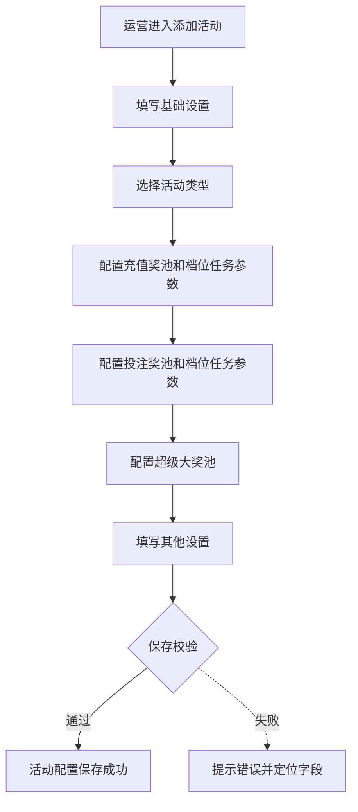
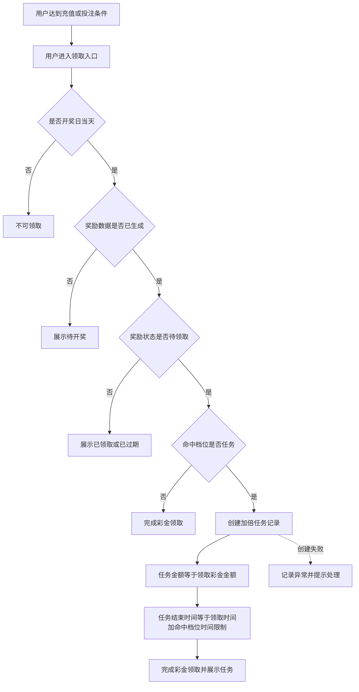
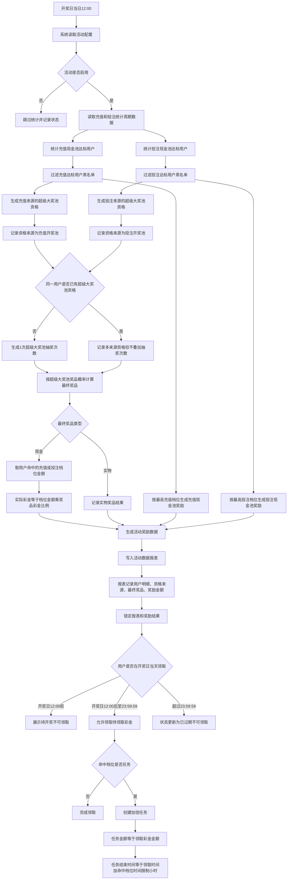
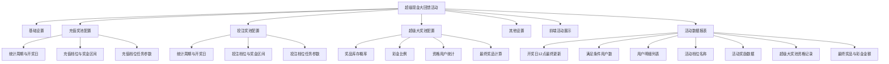

# 超级现金大回馈活动配置 PRD

## 目录
- [§1 修订追踪表](#1-修订追踪表)
- [§2 背景与目标](#2-背景与目标)
- [§3 功能清单](#3-功能清单)
- [§4 功能细节规格](#4-功能细节规格)
- [§5 功能流程图](#5-功能流程图)
- [§6 功能结构图](#6-功能结构图)
- [§7 页面设计 / Wireframe](#7-页面设计--wireframe)
- [§8 Corner Case](#8-corner-case)
- [§9 验收清单](#9-验收清单)

## 本文件使用说明
- 本 PRD 描述“超级现金大回馈”活动在运营管理后台的活动配置、奖池配置、档位任务参数与前端展示规则。
- 本 PRD 不包含每日数据导入配置；数据导入能力不在本次配置页范围内。
- 原型参考：`cashback-activity-prototype-standalone.html`。

## §1 修订追踪表

| 版本 | 日期 | 修订人 | 状态 |
|---|---|---|---|
| V1 | 2026-07-23 | Codex | 初稿（未送外部评审） |

## §2 背景与目标

### 2.1 背景
- 运营需要配置“超级现金大回馈”活动，活动由充值现金池、投注现金池、超级大奖池组成。
- 用户在活动周期内满足充值或投注档位后，可参与对应现金池抽奖。
- 用户达到任意充值档位或任意投注档位后，可获得超级大奖池资格。
- 后台需要支持配置奖池档位、奖金区间、开奖日、奖品、概率、库存、彩金比例和领取后任务规则。

### 2.2 目标
- 支持运营在“添加活动”界面完成活动基础信息、三个奖池和任务规则配置。
- 支持三个奖池配置项可编辑、可新增、可删除。
- 支持充值和投注开奖时间按“每月第几日”配置，不要求选择月份。
- 支持在充值奖池、投注奖池的每个档位中分别设置任务参数；用户命中档位的“是否任务”为“是”后，领取彩金时自动创建加倍任务记录。
- 支持开奖日当日 12 点对活动数据做最后自动统计更新，按充值、投注和超级大奖池统计口径捞取满足条件的用户数，同时计算最终奖励金额、生成对应活动奖励数据，并锁定活动数据报表。
- 支持充值现金池、投注现金池、超级大奖池按开奖池维度分别统计满足条件的用户数据，并在活动数据中记录。
- 支持在活动资格计算时过滤用户黑名单，黑名单用户不计入任一奖池活动资格。

### 2.3 非目标
- 不在本页面配置每日导入充值数据、投注数据。
- 不在本页面展示用户参与明细、中奖名单、派奖流水。
- 不在本页面配置实际任务完成判定口径以外的复杂风控规则。

## §3 功能清单

| 编号 | 页面 / 模块 | 类型 | 端 | 简介 |
|---|---|---|---|---|
| P1 | 添加活动配置页 | [MOD] | 运营后台 | 配置活动基础信息，活动类型下方直接配置三个奖池，其他设置下移并支持通知发送参数 |
| P2 | 充值奖池配置 | [NEW] | 运营后台 | 配置充值统计周期、开奖日、充值档位、奖金区间和档位任务参数 |
| P3 | 投注奖池配置 | [NEW] | 运营后台 | 配置投注统计周期、开奖日、投注档位、奖金区间和档位任务参数 |
| P4 | 超级大奖池配置 | [NEW] | 运营后台 | 配置超级大奖池奖品、类型、库存、概率、彩金比例和资格限制，并记录满足资格用户 |
| P5 | 前端活动展示 | [NEW] | 用户端 | 展示用户累计数据、当前档位、距下一档金额和开奖倒计时 |
| P6 | 活动数据报表生成 | [NEW] | 运营后台 | 开奖日当日 12 点最终更新满足条件用户数据，按对应奖池口径计算最终奖励金额，生成活动奖励数据，并在列表展示用户明细、档位名称和奖励结果 |

## §4 功能细节规格

### P1. 添加活动配置页

#### 4.1.1 页面入口与布局
- 入口：营销管理下的活动新增入口。
- 页面标题：添加活动。
- 页面不展示顶部页签区域，仅保留左侧菜单、添加活动主体和底部操作按钮。
- 表单自上而下顺序：
  - 基础设置。
  - 充值奖池配置。
  - 投注奖池配置。
  - 超级大奖池配置。
  - 其他设置。
- 活动类型选择后，三个奖池配置紧跟在活动类型下方，归属、标签、活动时间、前端展示、活动状态、备注统一下移到其他设置。

#### 4.1.2 基础设置

| 字段 | 类型 | 必填 | 默认值 | 说明 |
|---|---|---|---|---|
| 活动ID | 文本输入 | 是 | `CASHBACK202607` | 活动唯一标识，最多 15 个字符 |
| 活动标题 | 文本输入 | 是 | 超级现金大回馈 | 前后台活动标题，最多 15 个字符 |
| 活动说明 | 文本输入 | 是 | 充值投注双奖池 | 简短说明，最多 15 个字符 |
| 活动类型 | 下拉选择 | 是 | 现金池抽奖 | 选项至少包含现金池抽奖、充值活动、投注活动 |

#### 4.1.3 其他设置

| 字段 | 类型 | 必填 | 默认值 | 说明 |
|---|---|---|---|---|
| 归属 | 下拉选择 | 是 | 全站 | 支持全站、指定站点、指定代理线 |
| 标签 | 下拉选择 | 否 | 月度回馈 | 支持月度回馈、充值、投注等标签 |
| 站内信模板 | 下拉选择 | 否 | 请选择 | 选择活动通知或彩金领取通知使用的站内信模板 |
| 开始发送时间 | 日期时间输入 | 是 | 请选择开始时间 | 配置站内信开始发送时间 |
| 每小时发送次数 | 数字输入 | 是 | 0 | 控制站内信发送频率，仅允许整数，取值 0 至 999999 |
| 开始时间 | 日期时间输入 | 是 | 2026-07-01 00:00:00 | 活动整体生效开始时间 |
| 结束时间 | 日期时间输入 | 是 | 2026-07-22 23:59:59 | 活动整体生效结束时间 |
| 前端展示 | 单选 | 是 | 展示 | 控制用户端是否展示活动 |
| 活动状态 | 下拉选择 | 否 | 启用 | 支持启用、停用 |
| 备注 | 多行文本 | 否 | 规则摘要 | 记录运营备注 |

### P2. 充值奖池配置

#### 4.2.1 区域规则
- 位置：基础设置的活动类型下方。
- 统计周期展示在区域标题右侧：每月 1 日 00:00:00 至 11 日 23:59:59。
- 开奖时间展示在统计周期下方，以“开奖时间 + 数字输入 + 日”的形式配置。
- 开奖时间仅配置每月第几日，不选择月份。
- 默认充值开奖日为 12 日。
- 支持新增充值档位。
- 支持删除任一充值档位。
- 支持直接编辑档位金额、最小奖金、最大奖金、随机范围金额设置、是否任务、预充值金额、时间限制、参与规则。
- 充值奖池不再单独展示奖池级任务设置，任务参数随每个档位独立配置。

#### 4.2.2 默认档位

| 累计充值档位 | 最小奖金 | 最大奖金 | 随机范围金额设置 | 是否任务 | 预充值金额 | 时间限制(小时) | 参与规则 |
|---:|---:|---:|---:|---|---:|---:|---|
| 1000 | 18 | 88 | 88 | 是 | 0 | 24 | 按最高档位参与 |
| 3000 | 38 | 188 | 188 | 是 | 0 | 24 | 每人一次 |
| 5000 | 58 | 288 | 288 | 是 | 0 | 24 | 每人一次 |
| 10000 | 88 | 588 | 588 | 是 | 0 | 24 | 每人一次 |
| 20000 | 188 | 888 | 888 | 是 | 0 | 24 | 每人一次 |

#### 4.2.3 字段口径
- 最小奖金至最大奖金用于前端展示，用户端展示为该档位可获得的奖金区间。
- 最小奖金至随机范围金额设置用于用户实际计算奖金时的取值范围。
- 随机范围金额设置为实际奖励随机上限，必须大于或等于最小奖金，且小于或等于最大奖金。
- 是否任务、预充值金额、时间限制(小时)为档位级参数，用户领取该档位彩金时按命中档位的配置执行。
- 是否任务为“是”时，用户领取该档位彩金后自动创建加倍任务记录；是否任务为“否”时，不创建加倍任务。
- 预充值金额用于配置用户参与或领取该档位彩金前需要满足的预充值门槛。
- 时间限制(小时)用于配置加倍任务完成时限。

#### 4.2.4 参与规则
- 用户在充值统计周期内的累计充值金额达到档位后，获得对应充值现金池参与资格。
- 若用户达到多个充值档位，仅按最终达到的最高档位参与。
- 每个账号每个活动周期仅参与一次充值现金池开奖。
- 开奖日当日 12:00 生成最终用户数据时，同步计算用户最终奖励金额。
- 充值现金池最终奖励金额在“最小奖金”至“随机范围金额设置”之间随机给出。
- 随机范围金额设置为奖励随机上限，必须大于或等于最小奖金，且小于或等于最大奖金。
- 示例：用户累计充值 8680，最终进入 5000 档，参与 58 至 288 元奖池。

#### 4.2.5 充值彩金领取后的任务规则
- 当用户命中的充值档位“是否任务”为“是”时，用户领取充值现金池奖励后，系统为该用户自动创建一条加倍任务记录。
- 任务金额等于用户本次领取的充值现金池彩金金额。
- 任务结束时间按用户领取时间加上命中充值档位配置的“时间限制(小时)”计算。
- 当用户命中的充值档位“是否任务”为“否”时，用户领取充值现金池彩金后不创建加倍任务。
- 若任务创建失败，彩金领取结果不得被静默吞掉，需要给后台留下可追踪异常记录，并向用户展示明确提示或进入待处理状态。

### P3. 投注奖池配置

#### 4.3.1 区域规则
- 位置：充值奖池配置下方。
- 统计周期展示在区域标题右侧：每月 1 日 00:00:00 至 21 日 23:59:59。
- 开奖时间展示在统计周期下方，以“开奖时间 + 数字输入 + 日”的形式配置。
- 开奖时间仅配置每月第几日，不选择月份。
- 默认投注开奖日为 22 日。
- 支持新增投注档位。
- 支持删除任一投注档位。
- 支持直接编辑档位金额、最小奖金、最大奖金、随机范围金额设置、是否任务、预充值金额、时间限制、参与规则。
- 投注奖池不再单独展示奖池级任务设置，任务参数随每个档位独立配置。

#### 4.3.2 默认档位

| 累计投注档位 | 最小奖金 | 最大奖金 | 随机范围金额设置 | 是否任务 | 预充值金额 | 时间限制(小时) | 参与规则 |
|---:|---:|---:|---:|---|---:|---:|---|
| 100000 | 188 | 888 | 888 | 是 | 0 | 24 | 按最高档位参与 |
| 500000 | 388 | 1888 | 1888 | 是 | 0 | 24 | 每人一次 |
| 1000000 | 888 | 3888 | 3888 | 是 | 0 | 24 | 每人一次 |
| 3000000 | 1888 | 8888 | 8888 | 是 | 0 | 24 | 每人一次 |

#### 4.3.3 字段口径
- 最小奖金至最大奖金用于前端展示，用户端展示为该档位可获得的奖金区间。
- 最小奖金至随机范围金额设置用于用户实际计算奖金时的取值范围。
- 随机范围金额设置为实际奖励随机上限，必须大于或等于最小奖金，且小于或等于最大奖金。
- 是否任务、预充值金额、时间限制(小时)为档位级参数，用户领取该档位彩金时按命中档位的配置执行。
- 是否任务为“是”时，用户领取该档位彩金后自动创建加倍任务记录；是否任务为“否”时，不创建加倍任务。
- 预充值金额用于配置用户参与或领取该档位彩金前需要满足的预充值门槛。
- 时间限制(小时)用于配置加倍任务完成时限。

#### 4.3.4 参与规则
- 用户在投注统计周期内的累计投注金额达到档位后，获得对应投注现金池参与资格。
- 若用户达到多个投注档位，仅按最终达到的最高档位参与。
- 每个账号每个活动周期仅参与一次投注现金池开奖。
- 开奖日当日 12:00 生成最终用户数据时，同步计算用户最终奖励金额。
- 投注现金池最终奖励金额在“最小奖金”至“随机范围金额设置”之间随机给出。
- 随机范围金额设置为奖励随机上限，必须大于或等于最小奖金，且小于或等于最大奖金。
- 示例：用户累计投注 860000，最终进入 500000 档，参与 388 至 1888 元奖池。

#### 4.3.5 投注彩金领取后的任务规则
- 当用户命中的投注档位“是否任务”为“是”时，用户领取投注现金池奖励后，系统为该用户自动创建一条加倍任务记录。
- 任务金额等于用户本次领取的投注现金池彩金金额。
- 任务结束时间按用户领取时间加上命中投注档位配置的“时间限制(小时)”计算。
- 当用户命中的投注档位“是否任务”为“否”时，用户领取投注现金池彩金后不创建加倍任务。
- 若任务创建失败，彩金领取结果不得被静默吞掉，需要给后台留下可追踪异常记录，并向用户展示明确提示或进入待处理状态。

### P4. 超级大奖池配置

#### 4.4.1 区域规则
- 位置：投注奖池配置下方。
- 达到任意充值档位或任意投注档位的用户，可获得超级大奖池资格。
- 每个账号每个活动周期仅获得 1 次超级大奖池机会。
- 用户同时达到多个充值或投注档位时，不叠加超级大奖池机会。
- 超级大奖池需要按开奖池维度统计满足条件的用户数据，并写入活动数据。
- 支持新增奖品。
- 支持删除任一奖品。
- 支持编辑奖品名称、类型、库存、概率、彩金比例、资格限制。
- 彩金比例用于计算用户命中超级大奖池现金奖品后的实际可得彩金，现金类奖品必填，实物类奖品可配置为不适用。
- 超级大奖池现金奖品的实际可得彩金金额按用户获得资格时命中的充值或投注档位金额乘以彩金比例计算。
- 超级大奖池抽奖时，系统按奖品概率为用户计算最终获得的奖品。

#### 4.4.2 默认奖品

| 奖品名称 | 类型 | 库存 | 概率 | 彩金比例 | 资格限制 |
|---|---|---:|---:|---:|---|
| 1888元 | 现金 | 按预算 | 待配置 | 待配置 | 每账号每月一次 |
| 8888元 | 现金 | 按预算 | 待配置 | 待配置 | 不叠加次数 |
| 18888元 | 现金 | 按预算 | 待配置 | 待配置 | 不叠加次数 |
| 88888元 | 现金 | 按预算 | 待配置 | 待配置 | 不叠加次数 |
| iPhone 17 Pro Max | 实物 | 待配置 | 待配置 | 不适用 | 不叠加次数 |
| 空降宝贝 | 实物 | 待配置 | 待配置 | 不适用 | 不叠加次数 |
| 神秘大奖 | 实物 | 待配置 | 待配置 | 不适用 | 不叠加次数 |

### P5. 前端活动展示

#### 4.5.1 充值活动页
- 展示时间：充值统计周期内可展示充值活动进度。
- 展示内容：
  - 当前累计充值。
  - 当前档位。
  - 距离下一档金额。
  - 开奖倒计时。
  - 立即充值按钮。
- 示例：当前累计充值 8680，当前档位 5000 档，距离下一档 1320。

#### 4.5.2 投注活动页
- 展示时间：投注统计周期内可展示投注活动进度。
- 展示内容：
  - 当前累计投注。
  - 当前档位。
  - 距离下一档金额。
  - 开奖倒计时。
  - 立即投注按钮。
- 示例：当前累计投注 860000，当前档位 500000 档，距离下一档 140000。

### P6. 活动数据报表生成

#### 4.6.1 自动计算触发规则
- 系统在每月配置的开奖日当日 12:00 自动触发活动数据最终更新。
- 充值现金池按充值开奖日触发，默认每月 12 日 12:00。
- 投注现金池按投注开奖日触发，默认每月 22 日 12:00。
- 超级大奖池随每个开奖池触发统计：充值开奖池触发时统计充值达标带来的超级大奖池资格，投注开奖池触发时统计投注达标带来的超级大奖池资格。
- 最终更新触发后，系统根据对应统计周期内的最新数据重新计算满足活动条件的用户数据。
- 系统完成最终用户数据计算后，同步计算用户最终奖励金额并生成对应活动奖励数据。
- 活动奖励数据生成后，奖励状态默认为待领取。
- 若 12:00 前已存在预统计报表或临时报表，系统需在开奖日当日 12:00 对其做最后一次更新。
- 最后更新和奖励数据生成完成后，活动数据报表进入锁定状态，作为开奖、领取和后续核对依据。

#### 4.6.2 现金池取数规则
- 充值现金池计算时，从 VIP 充值列表中捞取统计周期内的充值数据。
- 系统按会员维度汇总累计充值金额。
- 系统按充值奖池配置判断用户是否达到参与档位，并在该档位“最小奖金”至“随机范围金额设置”之间随机生成最终奖励金额。
- 投注现金池计算时，从投注统计数据中捞取统计周期内的投注数据。
- 系统按会员维度汇总累计投注金额。
- 系统按投注奖池配置判断用户是否达到参与档位，并在该档位“最小奖金”至“随机范围金额设置”之间随机生成最终奖励金额。
- 系统记录满足条件的用户数、各档位用户数、用户对应最高档位及满足的活动档位名称。
- 系统在统计充值和投注现金池达标用户后，需要先过滤用户黑名单。
- 黑名单用户不计入充值现金池、投注现金池、超级大奖池的活动资格，不生成活动奖励数据，不写入有效活动数据报表。
- 未达到任一充值或投注档位的用户不进入对应现金池活动数据报表的中奖候选范围。

#### 4.6.3 超级大奖池统计与抽奖规则
- 超级大奖池活动数据按开奖池维度统计，充值开奖池和投注开奖池各统计一次满足条件用户数据。
- 充值开奖池统计时，达到任一充值档位的用户进入超级大奖池资格用户范围。
- 投注开奖池统计时，达到任一投注档位的用户进入超级大奖池资格用户范围。
- 黑名单用户即使达到充值或投注档位，也不进入超级大奖池资格用户范围。
- 活动数据中需记录超级大奖池资格用户明细，并标记资格来源为充值开奖池、投注开奖池或多来源。
- 同一用户在同一活动周期内通过多个开奖池满足超级大奖池资格时，活动数据可记录多个资格来源，但超级大奖池抽奖机会仍只保留 1 次。
- 超级大奖池资格统计需记录计算基准金额：资格来源为充值开奖池时，计算基准金额为用户最终命中的充值档位金额；资格来源为投注开奖池时，计算基准金额为用户最终命中的投注档位金额。
- 用户使用超级大奖池抽奖次数时，系统根据超级大奖池奖品概率计算该用户最终获得的奖品。
- 用户命中超级大奖池现金奖品后，实际可得彩金金额等于计算基准金额乘以该奖品配置的彩金比例。
- 用户命中超级大奖池实物奖品时，按实物奖品派发，不按彩金比例计算现金彩金。
- 超级大奖池统计记录至少包含归属、会员ID、会员账号、资格来源、计算基准金额、满足的活动档位名称、抽奖次数、最终奖品、统计周期、开奖日、生成时间、生成状态。

#### 4.6.4 报表生成规则
- 活动数据报表按活动、统计周期、奖池类型、开奖日生成。
- 同一活动、同一统计周期、同一奖池类型只生成一份有效报表。
- 开奖日当日 12:00 最后更新完成后应固化用户数据和奖励数据，后续充值、投注等统计数据源变化不自动改写已锁定报表。
- 若运营需要重新计算，需通过明确的重算入口或人工处理流程触发，并保留重算记录。
- 报表列表直接展示满足要求的用户明细，不仅展示汇总数量。
- 报表列表至少包含归属、会员ID、会员账号、奖池类型、资格来源、累计金额、计算基准金额、抽奖次数、最终奖品、彩金比例、满足的活动档位名称、奖金区间、奖励金额、奖励状态、统计周期、开奖日、领取截止时间、生成时间、生成状态。
- 报表汇总信息至少包含统计周期、开奖日、奖池类型、满足条件用户总数、各档位用户数、奖励生成总数、生成时间、生成状态。
- 活动奖励数据应与报表用户明细一一对应。
- 活动奖励数据至少包含会员ID、会员账号、奖池类型、资格来源、计算基准金额、抽奖次数、最终奖品、彩金比例、满足的活动档位名称、奖励金额、奖励状态、领取截止时间、生成时间。
- 充值现金池和投注现金池奖励金额在开奖日当日 12:00 生成最终用户数据时确定，生成后随报表一并锁定。
- 超级大奖池现金奖品奖励金额在用户按奖品概率命中奖品后按“计算基准金额 * 彩金比例”确定，并随中奖结果一并记录。
- 奖励状态至少包含待领取、已领取、已过期。

#### 4.6.5 彩金领取规则
- 彩金仅允许在对应奖池开奖日当日领取。
- 领取时间范围为开奖日 00:00:00 至开奖日 23:59:59。
- 用户在开奖日当日 12:00 奖励数据生成前进入领取入口时，应展示未开奖或待开奖状态，不允许领取。
- 用户在开奖日当日 12:00 奖励数据生成后，且奖励状态为待领取时，可领取对应彩金。
- 超过开奖日 23:59:59 后，仍未领取的彩金状态自动更新为已过期。
- 已过期彩金不可再领取，不创建加倍任务，不进入待派发流程。
- 若用户已在开奖日当日成功领取，奖励状态更新为已领取，后续不可重复领取。

#### 4.6.6 报表示例

| 活动名称 | 归属 | 会员ID | 会员账号 | 奖池类型 | 资格来源 | 累计金额 | 计算基准金额 | 抽奖次数 | 最终奖品 | 彩金比例 | 满足的活动档位名称 | 奖金区间 | 奖励金额 | 奖励状态 | 统计周期 | 开奖日 | 领取截止时间 | 生成状态 | 生成时间 |
|---|---|---:|---|---|---|---:|---:|---:|---|---:|---|---|---:|---|---|---:|---|---|---|
| 超级现金大回馈 | 全站 | 100238 | vip_a02 | 充值现金池 | 充值开奖池 | 8680 | - | - | - | - | 充值5000档 | 58-288元 | 188 | 待领取 | 2026-07-01 至 2026-07-11 | 12日 | 2026-07-12 23:59:59 | 已锁定 | 2026-07-12 12:00:00 |
| 超级现金大回馈 | 全站 | 100441 | vip_b19 | 充值现金池 | 充值开奖池 | 21800 | - | - | - | - | 充值20000档 | 188-888元 | 588 | 已领取 | 2026-07-01 至 2026-07-11 | 12日 | 2026-07-12 23:59:59 | 已锁定 | 2026-07-12 12:00:00 |
| 超级现金大回馈 | 指定代理线 | 100776 | vip_c77 | 投注现金池 | 投注开奖池 | 860000 | - | - | - | - | 投注500000档 | 388-1888元 | 888 | 已过期 | 2026-07-01 至 2026-07-21 | 22日 | 2026-07-22 23:59:59 | 已锁定 | 2026-07-22 12:00:00 |
| 超级现金大回馈 | 全站 | 100238 | vip_a02 | 超级大奖池 | 充值开奖池 | 8680 | 5000 | 1 | 1888元 | 10% | 充值5000档 | - | 500 | 待领取 | 2026-07-01 至 2026-07-11 | 12日 | 2026-07-12 23:59:59 | 已锁定 | 2026-07-12 12:00:00 |

## §5 功能流程图

### 5.1 活动配置流程

### 5.2 用户领取彩金与任务创建流程

### 5.3 活动数据、超级大奖池抽奖与领取流程

## §6 功能结构图

## §7 页面设计 / Wireframe

### 7.1 P1 添加活动配置页
- 默认状态：左侧保留运营管理后台菜单，主体为添加活动表单。
- 顶部页签：不展示“首页 / 活动列表 / 添加活动”标签栏。
- 基础设置：展示活动ID、活动标题、活动说明、活动类型。
- 活动类型下方：紧跟充值奖池、投注奖池、超级大奖池三个配置区域。
- 其他设置：展示归属、标签、活动时间、站内信模板、开始发送时间、每小时发送次数、前端展示、活动状态和备注。
- 页面底部：保留取消、确定按钮。

### 7.2 P2 充值奖池配置
- 区域标题左侧为“充值奖池配置”。
- 区域标题右侧展示统计周期和开奖日输入。
- 开奖日为数字输入，取值 1 至 31，默认 12。
- 表格列为累计充值档位、最小奖金、最大奖金、随机范围金额设置、是否任务、预充值金额、时间限制(小时)、参与规则、操作。
- 随机范围金额设置为奖励随机上限，用于计算最终奖励金额，取值不得小于最小奖金且不得大于最大奖金。
- 前端展示奖金区间使用最小奖金至最大奖金；实际奖励计算区间使用最小奖金至随机范围金额设置。
- 每行支持编辑与删除，区域支持新增档位。
- 每个充值档位行内展示是否任务、预充值金额、时间限制(小时)，不再展示独立任务设置区域。

### 7.3 P3 投注奖池配置
- 区域标题左侧为“投注奖池配置”。
- 区域标题右侧展示统计周期和开奖日输入。
- 开奖日为数字输入，取值 1 至 31，默认 22。
- 表格列为累计投注档位、最小奖金、最大奖金、随机范围金额设置、是否任务、预充值金额、时间限制(小时)、参与规则、操作。
- 随机范围金额设置为奖励随机上限，用于计算最终奖励金额，取值不得小于最小奖金且不得大于最大奖金。
- 前端展示奖金区间使用最小奖金至最大奖金；实际奖励计算区间使用最小奖金至随机范围金额设置。
- 每行支持编辑与删除，区域支持新增档位。
- 每个投注档位行内展示是否任务、预充值金额、时间限制(小时)，不再展示独立任务设置区域。

### 7.4 P4 超级大奖池配置
- 区域标题左侧为“超级大奖池配置”。
- 区域标题右侧展示资格说明和新增奖品按钮。
- 表格列为奖品名称、类型、库存、概率、彩金比例、资格限制、操作。
- 彩金比例支持编辑；现金类奖品取值为大于 0 且小于或等于 100 的百分比，实物类奖品可填不适用。
- 超级大奖池抽奖时，系统按奖品概率计算用户最终获得的奖品。
- 超级大奖池现金奖品的实际彩金金额按用户命中的充值或投注档位金额乘以彩金比例计算。
- 每行支持编辑与删除，区域支持新增奖品。

### 7.5 P5 前端活动展示
- 充值活动页展示累计充值、当前档位、距下一档金额、立即充值按钮和开奖倒计时。
- 投注活动页展示累计投注、当前档位、距下一档金额、立即投注按钮和开奖倒计时。
- 超级大奖池资格可在用户满足任一档位后展示为已获得。

### 7.6 P6 活动数据报表生成
- 活动数据报表可在运营后台报表或活动详情中查看。
- 报表列表直接展示满足要求的用户明细。
- 报表列表展示活动名称、归属、会员ID、会员账号、奖池类型、资格来源、累计金额、计算基准金额、抽奖次数、最终奖品、彩金比例、满足的活动档位名称、奖金区间、奖励金额、奖励状态、统计周期、开奖日、领取截止时间、生成状态、生成时间。
- 报表列表默认列可参考 §4.6.6 报表示例。
- 报表顶部或列表汇总区展示满足条件用户总数、各档位用户数和奖励生成总数。
- 开奖日当日 12:00 最终更新后的报表和奖励数据应展示为锁定结果，不随数据源变化自动刷新。

## §8 Corner Case

| 编号 | 场景 | 预期行为 |
|---|---|---|
| CC-1 | 开奖日输入为空 | 保存时拦截，并提示填写开奖日 |
| CC-2 | 开奖日小于 1 或大于 31 | 保存时拦截，并提示开奖日范围为 1 至 31 |
| CC-3 | 奖池档位为空或重复 | 保存时拦截，并提示重复或缺失档位 |
| CC-4 | 最小奖金大于最大奖金 | 保存时拦截，并提示奖金区间错误 |
| CC-5 | 删除所有档位 | 保存时拦截，至少保留一个有效档位 |
| CC-6 | 超级大奖池概率未配置 | 保存时提示待配置项，不允许误上线 |
| CC-6-1 | 超级大奖池现金奖品彩金比例为空或越界 | 保存时拦截，并提示彩金比例必须大于 0 且不超过 100% |
| CC-7 | 用户同时达到多个充值档位 | 仅按最高充值档位参与 |
| CC-8 | 用户同时达到多个投注档位 | 仅按最高投注档位参与 |
| CC-9 | 用户同时达到充值和投注资格 | 活动数据记录多个资格来源，超级大奖池机会仍为 1 次 |
| CC-10 | 充值或投注命中档位“是否任务”为“是”但时间限制为空 | 保存时拦截，并提示填写该档位的时间限制 |
| CC-11 | 用户领取彩金后任务创建失败 | 记录异常，并给出明确处理状态 |
| CC-12 | 命中档位“是否任务”为“否” | 用户领取该档位彩金后不创建加倍任务 |
| CC-13 | 开奖日当日 12 点活动已停用 | 不做最终更新，并记录跳过状态 |
| CC-14 | 充值、投注或超级大奖池资格取数失败 | 不更新或锁定错误报表，记录异常并等待重试 |
| CC-15 | 同一周期报表已锁定 | 不重复生成有效报表，需走重算流程 |
| CC-16 | 报表最终更新锁定后充值数据发生变化 | 已锁定报表保持固化，不自动改写 |
| CC-17 | 用户满足条件但档位名称缺失 | 报表生成失败或标记异常，不生成无档位名称的有效明细 |
| CC-18 | 活动奖励数据生成失败 | 不锁定错误奖励数据，记录异常并等待处理 |
| CC-19 | 用户明细与奖励数据数量不一致 | 不锁定报表，标记异常并等待处理 |
| CC-20 | 随机范围金额设置为空或越界 | 保存时拦截，并提示随机上限必须大于或等于最小奖金，且小于或等于最大奖金 |
| CC-21 | 用户在开奖日 12:00 前领取彩金 | 不允许领取，展示未开奖或待开奖状态 |
| CC-22 | 用户超过开奖日 23:59:59 后仍未领取 | 彩金状态自动更新为已过期，不允许领取 |
| CC-23 | 已过期彩金触发任务创建 | 不创建加倍任务，不进入待派发流程 |
| CC-24 | 超级大奖池资格用户重复统计 | 按开奖池记录资格来源，但同一活动周期内同一用户超级大奖池机会不重复增加 |
| CC-25 | 超级大奖池现金奖品彩金比例缺失 | 不生成有效中奖奖励，标记异常并等待运营处理 |
| CC-26 | 超级大奖池计算基准金额缺失 | 不计算实际彩金金额，标记异常并等待重算或人工处理 |
| CC-27 | 超级大奖池奖品概率配置异常 | 不执行抽奖，提示概率配置异常并等待运营处理 |
| CC-28 | 达标用户命中用户黑名单 | 不计入充值现金池、投注现金池、超级大奖池活动资格，不生成奖励数据 |
| CC-29 | 每小时发送次数为空、非整数或超过 0 至 999999 | 保存时拦截，并提示每小时发送次数仅支持 0 至 999999 的整数 |
| CC-30 | 开始发送时间为空 | 保存时拦截，并提示选择开始发送时间 |

## §9 验收清单

### 9.1 功能验收

| # | 功能名称 | 验收标准 | 判定方式 | 通过 |
|---|---|---|---|---|
| 1 | 添加活动配置页 | 活动类型下方直接展示三个奖池配置，其他设置在三个奖池之后 | 新建活动并检查页面顺序 | - [ ] |
| 2 | 顶部页签移除 | 页面不展示“首页 / 活动列表 / 添加活动”标签栏 | 打开页面查看顶部区域 | - [ ] |
| 2-1 | 其他设置通知参数 | 其他设置中展示站内信模板、开始发送时间、每小时发送次数；每小时发送次数仅允许 0 至 999999 的整数 | 打开页面填写并保存边界值 | - [ ] |
| 3 | 充值奖池配置 | 默认展示 5 个充值档位，字段可编辑，支持新增、删除，每个档位支持配置随机范围金额、是否任务、预充值金额、时间限制 | 编辑、新增、删除档位并保存随机范围和档位任务参数 | - [ ] |
| 4 | 投注奖池配置 | 默认展示 4 个投注档位，字段可编辑，支持新增、删除，每个档位支持配置随机范围金额、是否任务、预充值金额、时间限制 | 编辑、新增、删除档位并保存随机范围和档位任务参数 | - [ ] |
| 5 | 超级大奖池配置 | 默认展示 7 个奖品，字段可编辑，支持配置彩金比例、新增和删除 | 编辑彩金比例、新增、删除奖品并保存 | - [ ] |
| 6 | 开奖日配置 | 充值开奖日默认 12，投注开奖日默认 22，均只输入日数字 | 打开页面并检查开奖日输入形式 | - [ ] |
| 7 | 每人一次规则 | 用户达到多个同类档位时，仅获得最高档位资格 | 构造多档达标用户并核对资格 | - [ ] |
| 8 | 超级大奖池资格 | 用户达到任意充值或投注档位后，活动数据记录超级大奖池资格用户；充值开奖池和投注开奖池各统计一次，抽奖机会仅保留 1 次 | 构造充值、投注、充值投注均达标用户并核对活动数据和资格次数 | - [ ] |
| 9 | 档位任务参数 | 充值奖池和投注奖池每个档位行内均展示是否任务、预充值金额、时间限制(小时)，页面不展示独立任务设置区域 | 打开页面检查两个奖池配置区域 | - [ ] |
| 10 | 自动创建加倍任务 | 命中档位“是否任务”为“是”时，用户领取该档位彩金后生成 1 条加倍任务记录 | 用户领取充值或投注现金奖励后检查任务记录 | - [ ] |
| 11 | 任务金额 | 自动任务金额等于用户本次领取彩金金额 | 领取不同金额彩金并核对任务金额 | - [ ] |
| 12 | 任务结束时间 | 自动任务结束时间等于领取时间加命中档位配置小时数 | 配置充值或投注档位时间限制后领取并核对结束时间 | - [ ] |
| 13 | 非任务领取 | 命中档位“是否任务”为“否”时，用户领取该档位彩金后不生成加倍任务 | 切换命中档位为否后领取并检查任务记录 | - [ ] |
| 14 | 前端展示 | 用户端充值和投注活动页展示累计金额、当前档位、距下一档和开奖倒计时 | 使用不同累计金额账号查看活动页 | - [ ] |
| 15 | 活动数据最终更新 | 开奖日当日 12:00 自动按充值、投注和超级大奖池统计口径最终更新满足条件用户数据，同步计算最终奖励金额、生成活动奖励数据并锁定报表 | 模拟开奖日 12:00 后检查报表和奖励数据 | - [ ] |
| 16 | 报表结果固化 | 报表最终更新锁定后，充值、投注等数据源后续变化不自动改写既有报表和奖励数据 | 锁定报表后修改数据源并核对报表和奖励数据 | - [ ] |
| 17 | 报表用户明细 | 活动报表列表直接展示满足要求的用户明细和满足的活动档位名称 | 锁定报表后检查列表字段和用户记录 | - [ ] |
| 18 | 报表归属展示 | 活动报表列表展示每条用户明细对应归属 | 生成不同归属数据并检查报表列表 | - [ ] |
| 19 | 活动奖励数据 | 每条满足条件用户明细均生成对应活动奖励数据；充值和投注现金池奖励金额在对应档位最小奖金至随机范围金额设置之间，超级大奖池现金奖品奖励金额按计算基准金额乘以彩金比例计算 | 锁定报表后抽样核对奖励金额和奖励状态 | - [ ] |
| 20 | 随机范围金额设置 | 充值奖池和投注奖池每个档位均支持配置随机范围金额设置；最小奖金至最大奖金用于前端展示，最小奖金至随机范围金额设置用于实际奖励计算 | 配置边界值并保存，核对前端展示区间和实际计算区间 | - [ ] |
| 21 | 彩金领取时间 | 用户仅可在对应奖池开奖日当日领取彩金，开奖日 12:00 前不可领取，12:00 后至 23:59:59 可领取 | 分别模拟开奖日前、开奖日 12:00 前、开奖日 12:00 后和开奖日后领取 | - [ ] |
| 22 | 彩金过期 | 超过开奖日 23:59:59 后未领取的彩金状态更新为已过期，且不可再领取 | 模拟跨过领取截止时间后检查状态和领取入口 | - [ ] |
| 23 | 超级大奖池活动数据 | 每个开奖池开奖日 12:00 统计一次满足超级大奖池资格的用户数据，并在活动数据中记录奖池类型、资格来源和满足档位 | 分别模拟充值开奖日和投注开奖日，检查超级大奖池活动数据记录 | - [ ] |
| 24 | 超级大奖池抽奖 | 用户获得超级大奖池抽奖次数后，系统按奖品概率计算用户最终获得的奖品，并在活动数据中记录最终奖品 | 构造抽奖用户并核对最终奖品和奖品概率配置生效 | - [ ] |
| 25 | 超级大奖池彩金计算 | 用户命中超级大奖池现金奖品后，实际可得彩金金额等于命中的充值或投注档位金额乘以该奖品彩金比例 | 构造充值来源、投注来源中奖用户并核对奖励金额 | - [ ] |
| 26 | 黑名单过滤 | 充值或投注达标用户若命中用户黑名单，不计入任一奖池活动资格，不生成奖励数据，不进入有效活动数据报表 | 构造黑名单达标用户并检查现金池、超级大奖池资格和报表结果 | - [ ] |

### 9.2 非功能性验收

| # | 类别 | 验收标准 | 目标值 | 判定方式 | 通过 |
|---|---|---|---|---|
| 1 | 可用性 | 必填项缺失时可明确定位到字段 | 100% 必填项可定位 | 表单校验测试 | - [ ] |
| 2 | 稳定性 | 重复点击保存不产生重复活动或重复任务 | 0 重复记录 | 连续点击测试 | - [ ] |
| 3 | 权限 | 非授权角色不可新增或修改活动配置 | 100% 拦截 | 切换角色验证 | - [ ] |
| 4 | 数据准确性 | 档位资格、开奖资格、黑名单过滤、超级大奖池资格、最终奖品、奖励金额、任务金额计算结果正确 | 100% 与规则一致 | 测试账号核对 | - [ ] |
| 5 | 报表准确性 | 自动报表中的归属、用户明细、满足档位名称、资格来源、满足条件用户数和活动奖励数据与统计结果一致 | 100% 与统计口径一致 | 抽样核对报表和奖励数据 | - [ ] |

### 9.3 Corner Case 验收

| # | 场景 | 预期行为 | 判定方式 | 通过 |
|---|---|---|---|---|
| 1 | 开奖日为空或越界 | 保存失败并展示明确提示 | 边界值测试 | - [ ] |
| 2 | 奖池档位为空或重复 | 保存失败并展示明确提示 | 表单测试 | - [ ] |
| 3 | 奖金区间错误 | 保存失败并提示最小奖金不得大于最大奖金 | 表单测试 | - [ ] |
| 4 | 删除所有档位 | 保存失败并提示至少保留一个档位 | 删除后保存 | - [ ] |
| 5 | 多档位达标 | 仅按最高档位获得资格 | 用户数据测试 | - [ ] |
| 6 | 超级大奖池多条件达标 | 活动数据记录多个资格来源，仍只获得 1 次机会 | 用户数据测试 | - [ ] |
| 7 | 任务创建失败 | 有异常记录且用户可见处理状态 | 异常模拟 | - [ ] |
| 8 | 活动已停用 | 开奖日当日 12 点不做最终更新且不锁定有效报表 | 停用活动后模拟触发 | - [ ] |
| 9 | 报表重复生成 | 同一周期不产生多份有效报表 | 重复触发计算 | - [ ] |
| 10 | 档位名称缺失 | 不展示无档位名称的有效用户明细 | 构造异常档位数据 | - [ ] |
| 11 | 奖励数据生成失败 | 不锁定错误奖励数据并记录异常 | 构造奖励生成异常 | - [ ] |
| 12 | 随机范围金额越界 | 保存失败并提示随机上限必须大于或等于最小奖金，且小于或等于最大奖金 | 表单边界测试 | - [ ] |
| 13 | 开奖日 12 点前领取 | 不允许领取，展示未开奖或待开奖状态 | 时间点测试 | - [ ] |
| 14 | 彩金超过开奖日未领取 | 状态自动变更为已过期且不可领取 | 时间点测试 | - [ ] |
| 15 | 超级大奖池金额计算资料缺失 | 不生成错误奖励金额，标记异常 | 数据异常测试 | - [ ] |

### 9.4 专项验收

| # | 专项 | 验收标准 | 判定方式 | 通过 |
|---|---|---|---|---|
| 1 | 运营后台配置 | 活动保存后再次打开，所有配置项保持一致 | 保存后回显核对 | - [ ] |
| 2 | 用户端展示 | 前端仅在活动展示开启时展示活动入口 | 切换展示状态验证 | - [ ] |
| 3 | 档位任务联动 | 充值或投注档位开启任务后，领取对应档位彩金、生成任务、展示任务状态链路完整 | 端到端测试 | - [ ] |
| 4 | 报表链路 | 开奖日当日 12 点触发、取数、最终更新、生成奖励数据、锁定报表、查看报表链路完整 | 端到端测试 | - [ ] |

## 下一步建议
- 由业务确认超级大奖池库存和概率。
- 由运营分别确认充值档位和投注档位的预充值金额默认值和是否必填。
- 由开发确认加倍任务完成口径与现有任务系统字段是否一致。
- 由业务确认活动数据报表的查看入口、报表字段和重算权限。
- 由业务确认活动奖励数据的异常处理权限。
